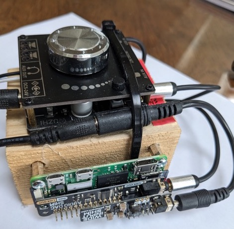
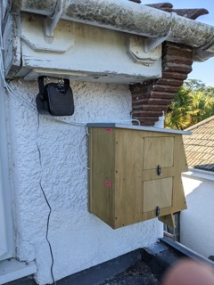
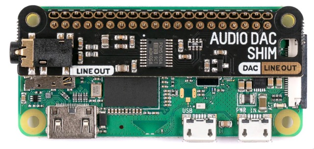
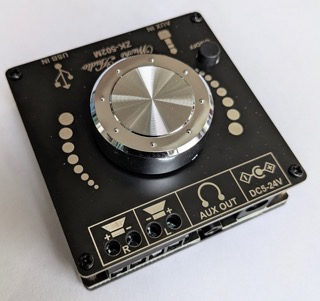
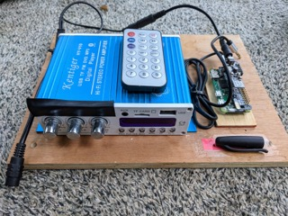
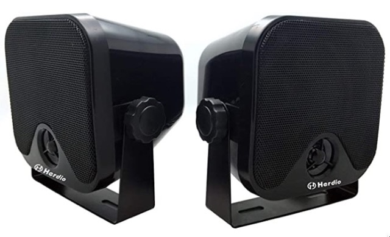

# swift-auto-caller
Plays swift calls at specified intervals

## Swift Call Player
- Objective: Play swift calls on a schedule
- Python script implementation:
    - Use the VLC library to play mp3 files.
    - Use the `schedule` library for scheduling playback.
    - Playback schedule: List of start and end times for daily play periods.
    - Sort the playback schedule in ascending order.
    - Loop through the mp3 file folder and play each mp3 file in alphanumeric order.
    - Determine the current play period based on the system time.
    - If the script starts outside a play period, print the next play period to the console.
    - Schedule playback for each media file at the start time of each play period.
    - Continuously loop through the folder and play the mp3 files during each play period.
    - Provide debug information, such as scheduled events and playback times.

## The Swiftomatic 3000
This is the (moderately bodged) finished article:

It consists of an Amp (the thing with the volume knob), a raspberry pi that is it s 'brains', a DAC ('Digital to Analogue Converter') and a speaker.  There's some cabling, a power supply and a micro SD card in the mix too. 

Here is the business end:

## Parts List...

**Raspberry Pi Zero**: To serve the audio files. **£15 ish**

I used a Zero 2 W, however at the time of writing these are as rare as *Hens Teeth*, so it should work on a Zero W or any other type of Raspberry pi.  Some Pis have a 3.5mm audio jack, so you may be able to skip some of this kit. A bit of soldering might be necessary if you get a Zero with no header (you need one).

**Hardware DAC**: Audio DAC shim from Pimoroni, approx **£13**
https://shop.pimoroni.com/products/audio-dac-shim-line-out

This pic is borrowed from their shop and shows it in situ on a Raspberry pi Zero W.  This doesn't need any soldering and just sits on the Pi's header pins which is neat.

**Amplifier**:  I settled on this cheap amp, approx £12.

It accepts input via USB mode/AUX mode/Bluetooth mode.  We'll use 3.5mm Aux cable to connect this to the audio DAC:
https://amzn.to/41y7P3C

I also tried this one which is less compact and has a load of stupid flashing LEDs (hence the black tape), it does have a radio which is mostly pointless but can convert your speaker to an 'annoy your neighbours' radio player out of season... https://amzn.to/41AvaSm 

**Wide Input Shim** from Pimoroni: Means it can all be powered from the same 12V supply: 
https://shop.pimoroni.com/products/wide-input-shim 

**Speaker**: I probably went overboard, and got this pair.  They are described as waterproof and push out a lot of sound in this combination.  I only used one for my system, the second going to an identical setup for another site.  Approx £36, cheaper options are available:
https://amzn.to/41Ski1L 

**Speaker cable**: The speaker came with some cable however I needed to run approx  50ft from my office to the position of the speaker and nest box.  Approx £17 for 100ft here:  https://amzn.to/41TXxe2 

**Misc extras**:
* 3.5mm Aux audio cable:    https://amzn.to/3H7NhGQ
* micro SD card for the Pi:        https://amzn.to/3L36lHn 
* 2-way 12v cable splitter:    https://amzn.to/40xKuxF 
* 12V, (at least) 2 Amp DC power supply.  Don't skimp on juice especially if running a bigger Pi (eg pi4)    https://amzn.to/41yZf4r    

## **Or Buy Swift calls player kit from Peak Boxes...**
Peak boxes have gone the same route as me, and I think uses the same Amp linked to above:  https://peakboxes.co.uk/shop-sound-systems

The main difference is that they get an audio source via USB input mode.  You load some swift calls onto a USB drive and plug it into the Amp and off it goes.  They suggest scheduling by putting the power supply on a 24hr timer.  Some suggestions here https://amzn.to/3oAFb3a (digital, £20)
 and here https://amzn.to/40xaSHY (mechanical, £17)

You *could* do it that way which is arguably easier, but much *less fun* IMO!.  Other things I'm considering that you cant do with a timer plug...
* Turn calls off when its raining by using data from a Weather API
* Control call settings: Schedule On/Off via a web page

## Pi configuration

1. Download and write the Buster Lite image to the SD card using Raspberry Pi Imager.
2. In the Config section of Raspberry Pi Imager, set the device name, Wi-Fi password and login for the pi user.
3. Run `sudo apt-get update` and `sudo apt-get upgrade`.
4. Install git: `sudo apt-get install git`.
5. Clone the GitHub repository: `git clone https://github.com/InfoMagix/swift-auto-caller.git`.
6. Install pip for Python 3: `sudo apt install python3-pip`.
7. Install virtual environments for Python 3: `sudo apt-get install python3-venv`.
8. Navigate to the cloned `swift-auto-caller` directory and add a virtual environment: `python3 -m venv .venv`.
9. Activate the virtual environment: `source .venv/bin/activate`.
10. Install VLC and its Python bindings: `sudo apt-get install vlc python3-vlc`.
11. Install the `schedule` package: `pip install schedule`.
12. Install the audio DAC shim by following the guide on their website
13. Reboot the Raspberry Pi: `sudo reboot`.
14. Run `aplay -l` to check that the audio DAC shim is recognised.
15. Test the script by running `/run.sh`.  To run it with no debug info returned, or as `/run.sh --debug` to get debug info including schedule, the current track being played.  You might need to run `chmod +x run.sh` first if it give 'access denied' errors.
16. Set to run at startup: Modify rc.local
    `sudo nano /etc/rc.local`

    Add this before the `"exit 0"` line: 
    
    `/home/pi/swift-auto-caller/run.sh --debug &` 
