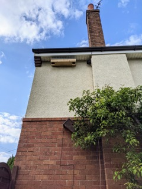
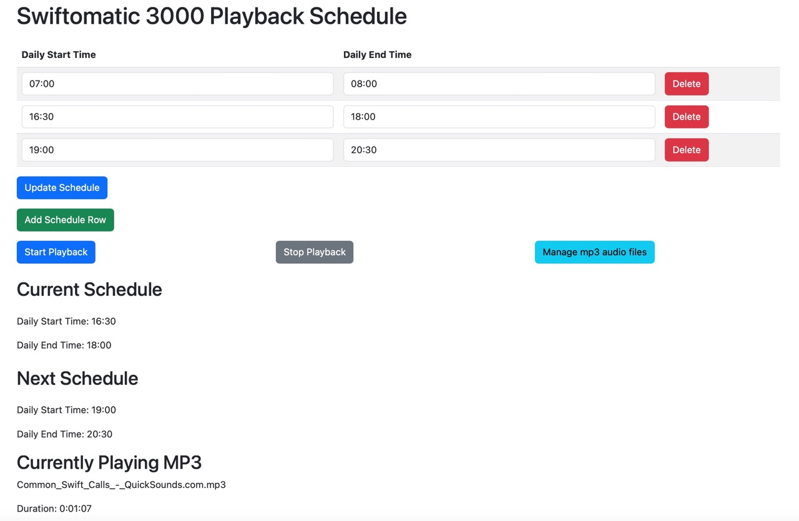
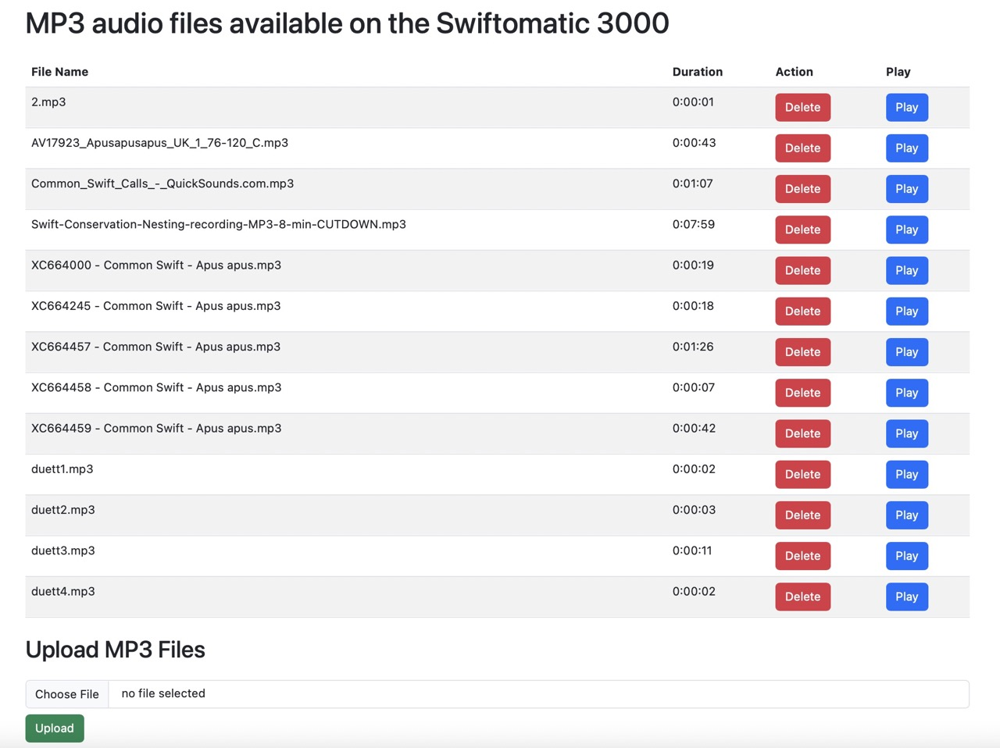

# swift-auto-caller

## The Swiftomatic 3000
* Plays swift calls at specified intervals.  
* Uses a Raspberry zero W + DAC to provide an Aux in audio feed to an inexpensive amp which in turn plays calls via a connected speaker.

* Swift call playback scheduling and  swift call audio file upload is user-configurable via interactive  web pages 

It consists of an Amp (the thing with the volume knob), a raspberry pi that is it s 'brains', a DAC ('Digital to Analogue Converter') and a speaker.  There's some cabling, a power supply and a micro SD card in the mix too. 

Here is the business end, its quite high up...

## User interface
The Raspberry pi host a web site where playback scheduling and audio files can be managed.  Its acessible on its local network via:
`http://<devicename>.local:5000` where `<devicename>` is the name that you call the raspberry pi in configuration part 1 section below.

### **Playback scheduling:**
Daily start and stop times can be set via a convenient web site.
Shows current schedule, next schedule and the name of the file currently being played:

### **Audio file upload:**
Upload any mp3 file, and review those already present.

## Parts List...

**Raspberry Pi Zero**: To serve the audio files. **£15 ish**

I used a Zero 2 W, however at the time of writing these are as rare as *Hens Teeth*, so it should work on a Zero W or any other type of Raspberry pi.  Some Pis have a 3.5mm audio jack, so you may be able to skip some of this kit. A bit of soldering might be necessary if you get a Zero with no header (you need one).

**Hardware DAC**: Audio DAC shim from Pimoroni, approx **£13**
https://shop.pimoroni.com/products/audio-dac-shim-line-out

This pic is borrowed from their shop and shows it in situ on a Raspberry pi Zero W.  This doesn't need any soldering and just sits on the Pi's header pins which is neat.

**Amplifier**:  I settled on this cheap amp, approx £12.

It accepts input via USB mode/AUX mode/Bluetooth mode.  We'll use 3.5mm Aux cable to connect this to the audio DAC:
https://amzn.to/41y7P3C

I also tried this one which is less compact and has a load of stupid flashing LEDs (hence the black tape), it does have a radio which is mostly pointless but can convert your speaker to an 'annoy your neighbours' radio player out of season... https://amzn.to/41AvaSm 

**Wide Input Shim** from Pimoroni: Means it can all be powered from the same 12V supply: 
https://shop.pimoroni.com/products/wide-input-shim 

**Speaker**: I probably went overboard, and got this pair.  They are described as waterproof and push out a lot of sound in this combination.  I only used one for my system, the second going to an identical setup for another site.  Approx £36, cheaper options are available:
https://amzn.to/41Ski1L 

**Speaker cable**: The speaker came with some cable however I needed to run approx  50ft from my office to the position of the speaker and nest box.  Approx £17 for 100ft here:  https://amzn.to/41TXxe2 

**Misc extras**:
* 3.5mm Aux audio cable:    https://amzn.to/3H7NhGQ
* micro SD card for the Pi:        https://amzn.to/3L36lHn 
* 2-way 12v cable splitter:    https://amzn.to/40xKuxF 
* 12V, (at least) 2 Amp DC power supply.  Don't skimp on juice especially if running a bigger Pi (eg pi4)    https://amzn.to/41yZf4r    

## **Or Buy Swift calls player kit from Peak Boxes...**
Peak boxes have gone the same route as me, and I think uses the same Amp linked to above:  https://peakboxes.co.uk/shop-sound-systems

The main difference is that they get an audio source via USB input mode.  You load some swift calls onto a USB drive and plug it into the Amp and off it goes.  They suggest scheduling by putting the power supply on a 24hr timer.  Some suggestions here https://amzn.to/3oAFb3a (digital, £20)
 and here https://amzn.to/40xaSHY (mechanical, £17)

You *could* do it that way which is arguably easier, but much *less fun* IMO!.  Other things I'm considering that you cant do with a timer plug...
* Turn calls off when its raining by using data from a Weather API
* Control call settings: Schedule On/Off via a web page

## Pi configuration part 1 - Do this first

1. Download and write the Buster Lite image to the SD card using Raspberry Pi Imager.
2. In the Config section of Raspberry Pi Imager, set the device name, Wi-Fi password, and login for the pi user.  Note that `<devicename>` is how you'll connect to it on your local network.

## Pi configuration part 2a - hands off install

This command will install everything:

`curl -sSL https://raw.githubusercontent.com/InfoMagix/swift-auto-caller/main/install_swift_auto_caller.sh | bash`

Alternatively, you can do the following:

1. Run `sudo apt-get update` and `sudo apt-get upgrade`.
2. Install git: `sudo apt-get install git`.
3. Clone the GitHub repository: `git clone https://github.com/InfoMagix/swift-auto-caller.git` 
4. Give install_swift_auto_caller.sh execute permissions using `chmod +x install_swift_auto_caller.sh`. 
5. Run the script using `./install_swift_auto_caller.sh`.

OR you can manually step through install_swift_auto_caller.sh

Some troubleshooting:

* Run `aplay -l` to check that the audio DAC shim is recognized.
* the `swift_auto_caller_web.py` script run the process.  To test its running as expected, navigate to `swift-auto-caller` then activate the virtual environment with `source .venv/bin/activate` then run ths script with debug setting turned on: `python swift_auto_caller_web.py --debug` 

Note that part of the setup script that installs the Audio DAC is taken from the Pimoroni website so might at some point change, refer to https://shop.pimoroni.com/products/audio-dac-shim-line-out for details if there are issues with that.